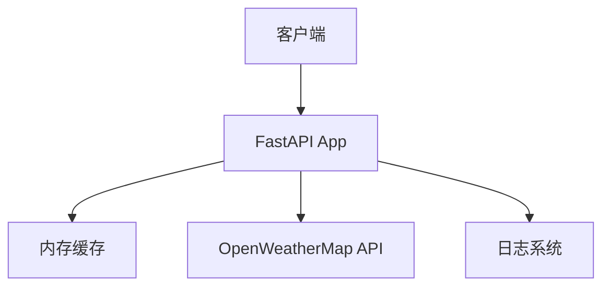

# 轻量级天气查询MCP服务需求文档 (PRD)

## 1. 项目概述
开发一款轻量级天气查询MCP服务，支持100并发用户访问，提供中英文天气查询服务。

## 2. 功能需求
- **实时天气查询**：通过城市名查询当前天气
- **3天天气预报**：提供未来3天天气预测
- **多语言支持**：自动检测中英文请求
- **基础气象数据**：温度、湿度、风速、天气状况
- **日志系统**：结构化日志记录所有操作

## 3. 非功能需求
- **性能**：支持100并发用户
- **部署**：本地Docker容器部署
- **数据存储**：不持久化历史天气数据
- **扩展性**：预留AI智能体接口

## 4. 技术架构


## 5. 技术栈
- **框架**: FastAPI + Uvicorn
- **缓存**: cachetools (TTLCache)
- **数据源**: OpenWeatherMap免费API
- **日志**: Python logging模块
- **部署**: Docker

## 6. API接口规范
### 6.1 天气查询接口
`GET /weather/{city}`
**参数**:
- `lang`: 语言 (zh/en)，默认en

**响应**:
```json
{
  "city": "Beijing",
  "temperature": 25.5,
  "humidity": 60,
  "wind_speed": 5.2,
  "description": "晴朗",
  "forecast": [
    {"date": "2023-10-01", "high": 26, "low": 18},
    {"date": "2023-10-02", "high": 24, "low": 17},
    {"date": "2023-10-03", "high": 23, "low": 16}
  ]
}
```

## 7. 实施计划
1. **基础框架搭建** (2天)
   - 创建项目结构
   - 安装依赖
   - FastAPI基础框架
2. **API集成** (2天)
   - OpenWeatherMap集成
   - 数据模型定义
3. **业务逻辑** (3天)
   - 天气查询路由
   - 内存缓存实现
   - 多语言支持
4. **系统完善** (2天)
   - 日志系统实现
   - Docker部署配置

## 8. AI扩展接口预留
```python
class AIAgentInterface:
    @abstractmethod
    def analyze_weather_trends(self, data: dict):
        """分析天气趋势"""
    
    @abstractmethod
    def generate_weather_report(self, data: dict):
        """生成智能天气报告"""